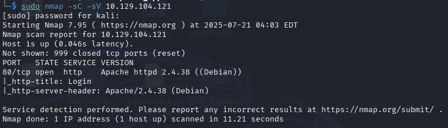
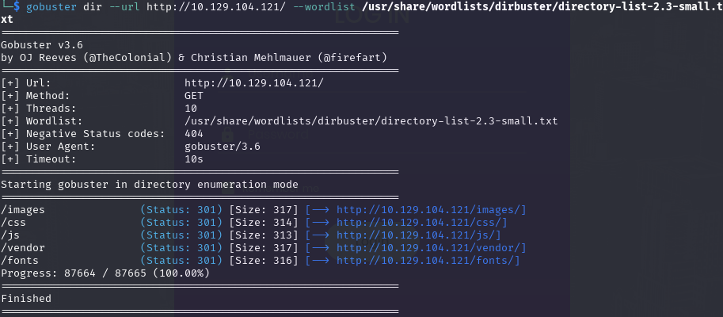
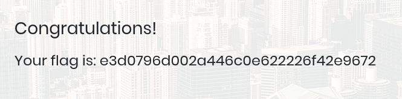
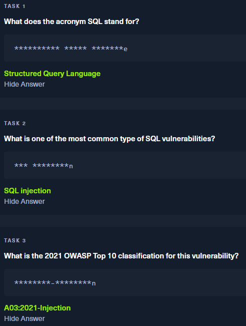
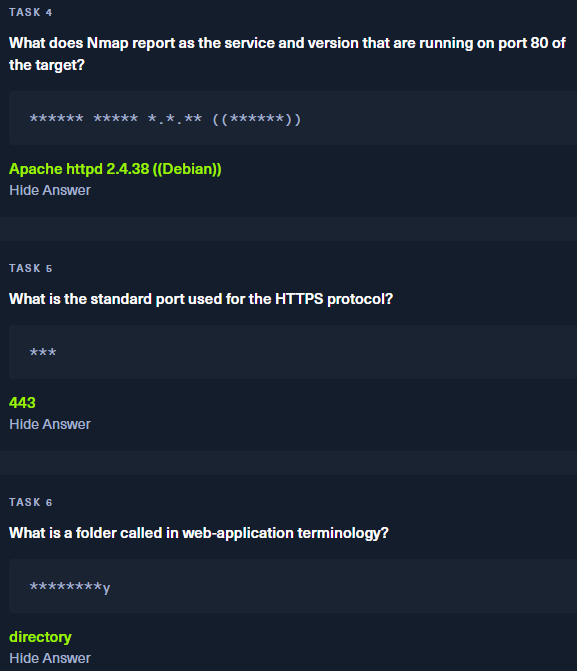
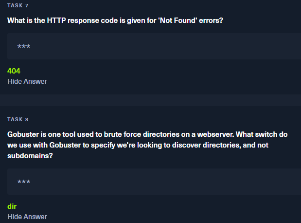
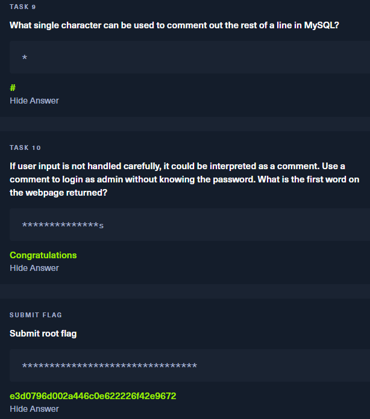

# HTB - Appointment 🩺

## 📌 Objective

Exploit the Hack The Box "Appointment" machine using reconnaissance, enumeration, and SQL injection techniques to obtain the flag.

---

## 🔍 1. Enumeration with Nmap

We run a basic scan with NSE scripts and version detection:

```bash
sudo nmap -sC -sV <IP_target>
```

**Result:**
- Port 80 open
- Service: HTTP (Apache 2.4.38)



---

## 🌐 2. Navigation to the web service

We access the HTTP service by navigating to the target IP address from the browser. A simple web interface is displayed, suggesting a possible web injection attack vector.

---

## 🗂️ 3. Brute force directories with Gobuster

Run Gobuster to discover hidden or sensitive directories:

```bash
gobuster dir -u http://<IP_target> -w /usr/share/wordlists/dirb/common.txt
```

**Result:**
No useful directories are discovered. The attack yields no relevant information.



---

## 🛡️ 4. Exploitation with SQL Injection and CTF

Since port 80 serves a web application, a classic SQL injection is tested:

- User: `admin'#`
- Password: `abc123` (the value is irrelevant)

Explanation:
- `'` closes the SQL string
- `#` comments out the rest of the line (in MySQL/PHP)

This allows **bypass de autenticación**, logging in as the administrator user.



---

## 🛡️ HTB Task





## ✅ Conclusions

- Enumeration with `nmap` and `gobuster` gave us initial visibility.
- The website was vulnerable to basic SQL injection.
- With a single injection, it was possible to gain administrator access and capture the flag.
- The importance of validating and filtering user input is demonstrated.
---

**Autor**: [Jesús]  
**HTB Username**: [JMCA]  
